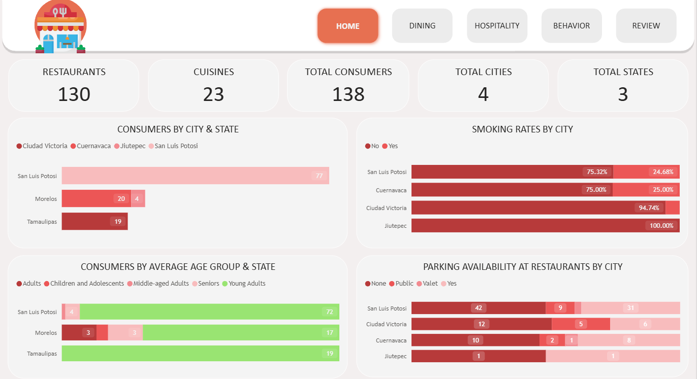
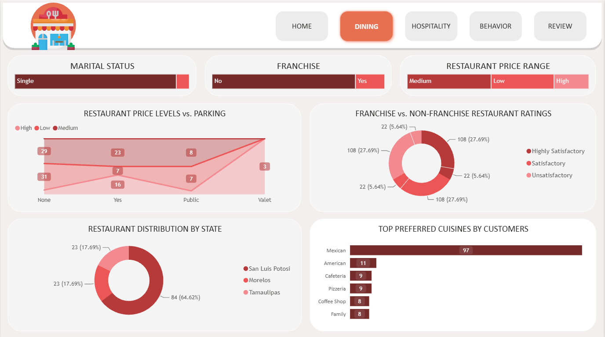
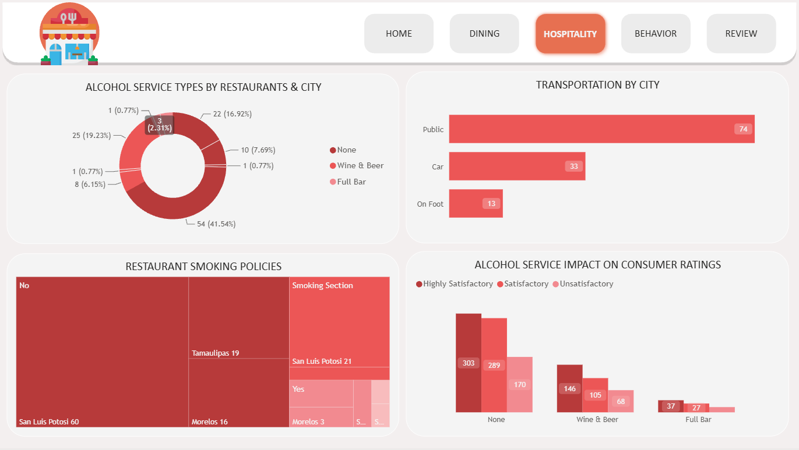
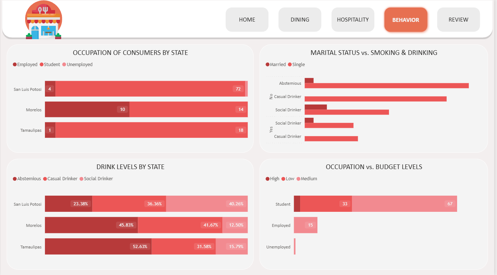
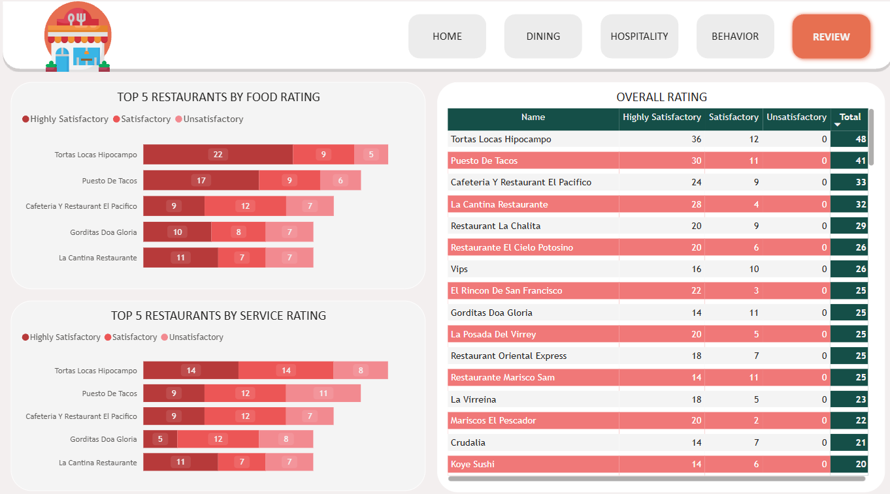

# Restaurant Operations & Customer Analytics

## Table of Content
* [Case Study](#case-study)
* [Tools Used](#tools-used)
* [Project Structure](#project-structure)
* [Dataset Description](#dataset-description)
* [ER Diagram](#er-diagram)
* [Data Cleaning](#data-cleaning)
* [Data Analysis](#data-analysis)
* [Dashboard](#dashboard)
* [Author](#author)

## Case Study
An end-to-end analysis of restaurant operations and customer behavior in Mexico, using real consumer ratings collected in 2012. The project looks at how operational factors — location, parking, alcohol service, smoking policy, pricing, and franchise status — relate to customer satisfaction, and how customer demographics (age, occupation, budget, lifestyle habits) shape dining preferences. The goal is to surface insights that would help restaurant operators make decisions about amenities, service offerings, and target customer segments.

## Tools Used
- **Power BI** — interactive dashboard and DAX calculated fields for rating/age categorization
- **SQL** — relational queries across consumers, restaurants, ratings, and cuisine tables ([`insights_queries.sql`](sql_analysis/insights_queries.sql))
- **Python (pandas)** — the same analysis reproduced two ways: via `sqlite3` + SQL ([`insights_analysis.py`](python_analysis/insights_analysis.py)) and via pure pandas transformations with no SQL ([`insights_analysis_pandas.py`](python_analysis/insights_analysis_pandas.py))
- **Jupyter Notebook** — exploratory data analysis and visualizations [`Restaurant_Operations_&_Customer_Analytics.ipynb`](python_analysis/Restaurant_Operations_%26_Customer_Analytics.ipynb)


---

## Project Structure

```text
Restaurant-Operations-Customer-Analytics/
│
├── dataset/                                # Raw restaurant dataset
│   ├── consumer_preferences.csv            # Customer preferred cuisines
│   ├── consumers.csv                       # Consumer demographic & lifestyle information
│   ├── ratings.csv                         # Food, service and overall ratings
│   ├── restaurant_cuisines.csv             # Cuisine served by each restaurant
│   └── restaurants.csv                     # Restaurant details and operational attributes
│
├── images/                                 # Images used in README
│   ├── behaviour.png                       # Customer Behaviour dashboard
│   ├── dining.png                          # Dining dashboard
│   ├── er_diag.png                         # Entity Relationship diagram
│   ├── home.png                            # Dashboard Home page
│   ├── hospitality.png                     # Hospitality dashboard
│   └── review.png                          # Customer Review dashboard
│
├── PowerBI/
│   ├── Restaurant Operations Customer Analytics.pbix
│   │                                     # Editable Power BI dashboard
│   └── Restaurant Operations Customer Analytics.pdf
│                                         # Exported dashboard report
│
├── python_analysis/
│   ├── insights_analysis.py              # Analysis using SQLite + SQL queries
│   ├── insights_analysis_pandas.py       # Same analysis using only pandas
│   └── Restaurant_Operations_&_Customer_Analytics.ipynb
│                                         # Interactive notebook for exploration and visualization
│
├── sql_analysis/
│   └── insights_queries.sql              # SQL queries used for business insights
│
└── README.md                             # Project documentation
```
--- 

## Dataset Description
Our data set consists of the following observations which include:

#### Consumers
- **Consumer_ID** - Unique identifier for each consumer
- **City** - City where the consumer lives
- **State** - State where the consumer lives
- **Country** - Country where the consumer lives
- **Latitude** - Latitude where the consumer lives
- **Longitude** - Longitude where the consumer lives
- **Smoker** - Whether the consumer smokes or not
- **Drink_Level** - Whether the consumer is an abstemious, casual, or social drinker
- **Transportation_Method** - Whether the consumer transports on foot, by public transport, or by car
- **Marital_Status** - The consumer's marital status (single or married)
- **Children** - Whether the consumer has dependent/independent children or kids
- **Age** - The consumer's age
- **Occupation** - The consumer's occupation (student, employed, or unemployed)
- **Budget** - The consumer's budget (low, medium, high)

#### Consumer_Preferences
- **Consumer_ID** - Unique identifier for each consumer
- **Preferred_Cuisine** - Types of food the consumer prefers

#### Ratings
- **Consumer_ID** - Unique identifier for each consumer
- **Restaurant_ID** -  Unique identifier for each restaurant
- **Overall_Rating** - The overall rating by the consumer for the restaurant (0=Unsatisfactory, 1=Satisfactory, 2=Highly Satisfactory)
- **Food_Rating** - The food's rating by the consumer for the restaurant (0=Unsatisfactory, 1=Satisfactory, 2=Highly Satisfactory)
- **Service_Rating** - The service rating by the consumer for the restaurant (0=Unsatisfactory, 1=Satisfactory, 2=Highly Satisfactory)

#### Restaurants
- **Restaurant_ID** - Unique identifier for each restaurant
- **Name** - The restaurant's name
- **City** - The restaurant's city
- **State** - The restaurant's state
- **Country** - The restaurant's country
- **Zip_Code** - The restaurant's zip code
- **Latitude** - The restaurant's latitude
- **Longitude** - The restaurant's longitude
- **Alcohol_Service** - Whether the restaurant serves no alcohol, wine & beer, or a full bar
- **Smoking_Allowed** - Whether any smoking is allowed, including in the bar or in smoking sections
- **Price** - The restaurant's price (low, medium, high)
- **Franchise** - Whether the restaurant is a franchise
- **Area** - Whether the restaurant is in an open or closed area
- **Parking** - Whether the restaurant offers any sort of parking (none, yes, public, valet)

#### Restaurant_Cuisines
- **Restaurant_ID** -  Unique identifier for each restaurant
- **Cuisine** -	Types of food the restaurant serves

## ER Diagram


## Data Cleaning
### Steps to import data as a folder
1. Get data -> More -> All -> Folder -> Connect -> Path leading to the folder dataset -> Click ok
2. Click on transform data -> Duplicate the file -> Click on Binary to expand the dataset (Repeat the set for the no of datasets)
3. Calculated Fields (Age Group, Service/Overall/Food Rating Category) — see `insights_queries.sql` for the SQL equivalents used in this repo's analysis.

## Data Analysis
Insights are grouped into two lenses: **Operations** (restaurant-side factors like parking, alcohol service, smoking policy, pricing, franchise status) and **Customer Analytics** (demographics, lifestyle habits, preferences, and how they connect back to satisfaction).

### Location & Customer Base (Operations)
- What is the distribution of consumers by city and state?

    Most of the population is from San Luis Potosí, San Luis Potosí, while the second largest group is from Cuernavaca, Morelos.

    ```sql
    SELECT City, State, COUNT(*) AS num_consumers
    FROM consumers
    GROUP BY City, State
    ORDER BY num_consumers DESC;
    ```

- How does the age distribution of consumers vary by state?

    In all three states, young adults under 30 years of age form the majority of the population. In two states, San Luis Potosí and Morelos, the second largest demographic consists of seniors, aged over 60 years.

    ```sql
    SELECT State,
           CASE WHEN Age < 30 THEN 'Under 30'
                WHEN Age <= 60 THEN '30-60'
                ELSE 'Over 60' END AS Age_Group,
           COUNT(*) AS num_consumers
    FROM consumers
    GROUP BY State, Age_Group
    ORDER BY State, num_consumers DESC;
    ```

- What percentage of consumers are smokers or non-smokers in each city?

    The vast majority of consumers from all four cities are non-smokers, with Jiutepec having a 100% non-smoking population. In Cuernavaca city, smokers make up 25% of the population.

    ```sql
    SELECT City,
           ROUND(100.0 * SUM(CASE WHEN Smoker = 'Yes' THEN 1 ELSE 0 END) / COUNT(*), 1) AS pct_smokers,
           ROUND(100.0 * SUM(CASE WHEN Smoker = 'No'  THEN 1 ELSE 0 END) / COUNT(*), 1) AS pct_nonsmokers,
           COUNT(*) AS total_consumers
    FROM consumers
    GROUP BY City;
    ```

- How common is parking availability at restaurants in different cities?
    
    The majority of restaurants across all cities lack parking facilities, while some have parking available. In San Luis Potosí and Cuernavaca, two restaurants offer valet parking, while public parking is available in San Luis Potosí, Ciudad Victoria, and Cuernavaca.

    ```sql
    SELECT City, Parking, COUNT(*) AS num_restaurants
    FROM restaurants
    GROUP BY City, Parking
    ORDER BY City, num_restaurants DESC;
    ```

### Restaurant Operations & Pricing
- How does the availability of parking correlate with restaurant price levels?
    
    Out of the 16 high-priced restaurants, 16 have parking available, with 3 offering valet parking, 1 providing public parking, and 5 lacking any parking options. Medium and low-priced restaurants do not offer valet parking; however, some provide public parking or have parking available, while others do not have parking available at all.

    ```sql
    SELECT Price, Parking, COUNT(*) AS num_restaurants
    FROM restaurants
    GROUP BY Price, Parking
    ORDER BY Price, num_restaurants DESC;
    ```

- What is the distribution of restaurants by state?

    San Luis Potosí has 84 restaurants, whereas Morelos and Tamaulipas each have 23 restaurants.

    ```sql
    SELECT State, COUNT(*) AS num_restaurants
    FROM restaurants
    GROUP BY State
    ORDER BY num_restaurants DESC;
    ```

- How do restaurant franchises compare to non-franchises in terms of consumer ratings?

    The majority of the restaurants are non-franchises, and they are equally distributed across three rating categories: unsatisfactory, satisfactory, and highly satisfactory. A small portion of the restaurants are franchises, and they are also equally distributed across the same three rating categories.

    ```sql
    SELECT rs.Franchise,
           CASE r.Overall_Rating WHEN 0 THEN 'Unsatisfactory'
                                  WHEN 1 THEN 'Satisfactory'
                                  ELSE 'Highly Satisfactory' END AS Rating_Category,
           COUNT(*) AS num_ratings
    FROM ratings r
    JOIN restaurants rs ON r.Restaurant_ID = rs.Restaurant_ID
    GROUP BY rs.Franchise, Rating_Category
    ORDER BY rs.Franchise, num_ratings DESC;
    ```

- What are consumers' preferred cuisines based on their demographic profiles?

    Mexican cuisine is the most preferred, followed by American cuisine.

    ```sql
    SELECT Preferred_Cuisine, COUNT(*) AS num_consumers
    FROM consumer_preferences
    GROUP BY Preferred_Cuisine
    ORDER BY num_consumers DESC
    LIMIT 5;
    ```

### Hospitality & Service Offerings
- How does the type of alcohol service offered vary by restaurants in each city?

    In the four cities combined—Jiutepec, San Luis Potosí, Cuernavaca, and Ciudad Victoria—66.92% of restaurants don't offer alcohol, 6.93% offer a full bar, and 26.15% offer wine and beer.

    ```sql
    SELECT Alcohol_Service, COUNT(*) AS num_restaurants,
           ROUND(100.0 * COUNT(*) / (SELECT COUNT(*) FROM restaurants), 2) AS pct
    FROM restaurants
    GROUP BY Alcohol_Service
    ORDER BY num_restaurants DESC;
    ```

- What transportation methods are most commonly used by consumers?

    61% of consumers use public transportation, 27% use cars, and 11% walk.

    ```sql
    SELECT Transportation_Method, COUNT(*) AS num_consumers,
           ROUND(100.0 * COUNT(*) / (SELECT COUNT(*) FROM consumers), 1) AS pct
    FROM consumers
    GROUP BY Transportation_Method
    ORDER BY num_consumers DESC;
    ```

- How does the presence of alcohol service influence consumer ratings?

    Among non-drinkers, 303 rated their experience as highly satisfactory, 289 as satisfactory, and 170 as unsatisfactory. For wine and beer consumers, the ratings were 146 highly satisfactory, 105 satisfactory, and 68 unsatisfactory. At full bars, 37 rated highly satisfactory, 27 satisfactory, and 16 unsatisfactory.

    ```sql
    SELECT rs.Alcohol_Service,
           CASE r.Overall_Rating WHEN 0 THEN 'Unsatisfactory'
                                  WHEN 1 THEN 'Satisfactory'
                                  ELSE 'Highly Satisfactory' END AS Rating_Category,
           COUNT(*) AS num_ratings
    FROM ratings r
    JOIN restaurants rs ON r.Restaurant_ID = rs.Restaurant_ID
    GROUP BY rs.Alcohol_Service, Rating_Category
    ORDER BY rs.Alcohol_Service, num_ratings DESC;
    ```

- What percentage of restaurants allow smoking in each state?

    Roughly 73% of restaurants maintain smoke-free policies, while only 1.5% in San Luis Potosí and Morelo allow smoking in bar sections. About 7% of restaurants permit smoking overall, with approximately 18.46% offering designated smoking areas.

    ```sql
    SELECT Smoking_Allowed, COUNT(*) AS num_restaurants,
           ROUND(100.0 * COUNT(*) / (SELECT COUNT(*) FROM restaurants), 2) AS pct
    FROM restaurants
    GROUP BY Smoking_Allowed;
    ```

### Customer Behavior & Demographics
- What are the common occupations of consumers in different state?

    In San Luis Potosí, 93% of the population consists of students, with the remaining portion comprising both employed and unemployed individuals. In Morelos, the population is almost equally split between employed individuals and students. In Tamaulipas, 94% of the population are students, while the remaining 6% are employed.

    ```sql
    SELECT State, Occupation, COUNT(*) AS num_consumers
    FROM consumers
    GROUP BY State, Occupation
    ORDER BY State, num_consumers DESC;
    ```

- How does the drink level (abstemious, casual, social) vary across different states?

    In San Luis Potosí, almost 40% of the population are social drinkers, 36% are casual drinkers, and 23% are abstemious. In Morelos, 45% are abstemious, 41% are casual drinkers, and 12% are social drinkers. In Tamaulipas, 52% are abstemious, 31% are casual drinkers, and 15% are social drinkers.

    ```sql
    SELECT State, Drink_Level, COUNT(*) AS num_consumers,
           ROUND(100.0 * COUNT(*) / (
               SELECT COUNT(*) FROM consumers c2 WHERE c2.State = consumers.State
           ), 1) AS pct_of_state
    FROM consumers
    GROUP BY State, Drink_Level
    ORDER BY State, num_consumers DESC;
    ```

- How does marital status correlate with smoking or drinking habits?

    Among 88 single consumers, all are non-smokers, with values decreasing respectively as abstemious, casual drinkers, and social drinkers. Among the married non-smokers, 2 are abstemious and 5 are social drinkers. Additionally, 23 single consumers smoke with values combined, and they are social drinkers and casual drinkers. Lastly, 2 married smokers are also social drinkers.

    ```sql
    SELECT Marital_Status, Smoker, Drink_Level, COUNT(*) AS num_consumers
    FROM consumers
    GROUP BY Marital_Status, Smoker, Drink_Level
    ORDER BY Marital_Status, Smoker, num_consumers DESC;
    ```

- Is there a relationship between consumers' occupations and their budget levels?

    Among the students, 67 have a medium budget, 33 have a low budget, and 4 have a high budget. Additionally, 15 employed individuals and 1 unemployed individual have a medium budget.

    ```sql
    SELECT Occupation, Budget, COUNT(*) AS num_consumers
    FROM consumers
    GROUP BY Occupation, Budget
    ORDER BY Occupation, num_consumers DESC;
    ```

### Customer Satisfaction & Reviews
- What are the top 5 restaurants by food rating?

    The top 5 restaurants with high customer satisfaction - food ratings are Tortas Locas Hipocampo and Puesto de Tacos, where most consumers are highly satisfied. Cafeteria y Restaurante El Pacífico has 9 consumers rating it highly satisfactory, while Gorditas Doa Gloria has received 10. La Cantina Restaurante is rated highly satisfactory by 11 consumers, with the remaining votes split between satisfactory and unsatisfactory.

    ```sql
    SELECT rs.Name,
           SUM(CASE WHEN r.Food_Rating = 2 THEN 1 ELSE 0 END) AS highly_satisfactory,
           SUM(CASE WHEN r.Food_Rating = 1 THEN 1 ELSE 0 END) AS satisfactory,
           SUM(CASE WHEN r.Food_Rating = 0 THEN 1 ELSE 0 END) AS unsatisfactory,
           COUNT(*) AS total_ratings
    FROM ratings r
    JOIN restaurants rs ON r.Restaurant_ID = rs.Restaurant_ID
    GROUP BY rs.Name
    ORDER BY highly_satisfactory DESC
    LIMIT 5;
    ```

- What are the top 5 restaurants by service rating?

    The top 5 restaurants with high customer satisfaction for service ratings are Tortas Locas Hipocampo, where most consumers are satisfied. Puesto de Tacos has received 12 satisfied consumer ratings. Cafeteria y Restaurante El Pacífico also has 12 consumers rating it as satisfactory, while Gorditas Doña Gloria has received the same number. La Cantina Restaurante is rated satisfactory by 7 consumers, with the remaining votes split between highly satisfactory and unsatisfactory.

    ```sql
    SELECT rs.Name,
           SUM(CASE WHEN r.Service_Rating = 2 THEN 1 ELSE 0 END) AS highly_satisfactory,
           SUM(CASE WHEN r.Service_Rating = 1 THEN 1 ELSE 0 END) AS satisfactory,
           SUM(CASE WHEN r.Service_Rating = 0 THEN 1 ELSE 0 END) AS unsatisfactory,
           COUNT(*) AS total_ratings
    FROM ratings r
    JOIN restaurants rs ON r.Restaurant_ID = rs.Restaurant_ID
    GROUP BY rs.Name
    ORDER BY highly_satisfactory DESC
    LIMIT 5;
    ```

- What are the top 5 restaurants by overall rating?

    The top five restaurants with high customer satisfaction ratings are Tortas Locas Hipocampo, where most consumers are highly satisfied, and Puesto de Tacos, which has received 30 highly satisfied consumer ratings. Cafeteria y Restaurante El Pacífico follows closely with 24 consumers rating it as highly satisfactory, while La Cantina Restaurante boasts 28 highly satisfied ratings. Rounding out the list, Restaurant la Chalita has garnered 20 high satisfaction ratings from its customers.

    ```sql
    SELECT rs.Name,
           SUM(CASE WHEN r.Overall_Rating = 2 THEN 1 ELSE 0 END) AS highly_satisfactory,
           SUM(CASE WHEN r.Overall_Rating = 1 THEN 1 ELSE 0 END) AS satisfactory,
           SUM(CASE WHEN r.Overall_Rating = 0 THEN 1 ELSE 0 END) AS unsatisfactory,
           COUNT(*) AS total_ratings
    FROM ratings r
    JOIN restaurants rs ON r.Restaurant_ID = rs.Restaurant_ID
    GROUP BY rs.Name
    ORDER BY highly_satisfactory DESC
    LIMIT 5;
    ```

## Dashboard

### Dashboard Pages
### Home
<p align="center">
  
</p>

### Dining
<p align="center">
  
</p>

### Hospitality
<p align="center">
  
</p>

### Behaviour
<p align="center">
  
</p>

### Review
<p align="center">
  
</p>

<a id="author"></a>
## 👤 Author

# Aman Jaiswal
[](https://github.com/amanjaiswal-07)
[](https://linkedin.com/in/aman-jaiswal-aa31b51b5)

---
